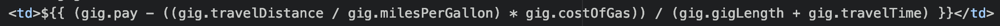
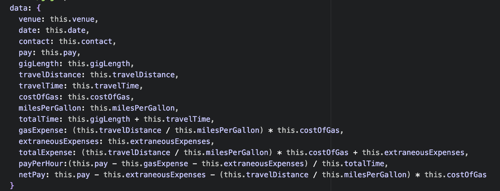

# The Gig Calculator

The Gig Calculator is a MEAN stack application that is styled using the CSS framework, Bulma. It is my final project for my Software Engineering Immersive class at General Assembly. It is a full CRUD app that takes all the variables of a freelance gig, and calculates what you'll actually be making for each gig. Gigs highlighted in green are profitable while gigs highlighted in red are not profitable. Live-link [here](https://gigkeeper.herokuapp.com/).

## Approach Taken

I knew I had to come up with an easy to way to make sense of the data I was asking for, so I made the layout of my index page a chart. I then used AngularJS to manipulate the DOM and change the numbers for each column accordingly. I used a form with the following data points that I needed from the user to make calculations. They are:

* Venue
* Date
* Contact
* Pay
* Gig Length (in Hours)
* Travel Distance (in Miles)
* Travel Time (in Hours)
* Cost of Gas Per Gallon
* Vehicles Mile Per Gallon
* Extraneous Expenses

I wanted to make the user experience as simple as possible so I only put pertinent information into the chart. That data points include:

* Venue
* Date
* Contact
* Gross Pay
* Gas Expense
* Total Expense
* Total Work Hours
* Pay Per Hour
* Net Pay

A visual example of what I'm describing is below:

## Technology Used
The app uses an express server, a mongodb database, nodeJS, and AngularJS. What I learned during this app is that you can add math expressions in your callbacks, and also in your Angular Tags.

Angular Tag:

I initially had all the expressions in angular tags, but that became unwieldy to read. Once I figured out that I could do math with key-pair objects in my routes, it was game on.

Callback:

## CRUD
The app features all of the CRUD routes, I'd be remiss to not mention that.

## New Tech (For Me)
This project was all about teaching yourself a new piece of technology. My initial build used VueJs, but after a long battle, I cut my losses, went with what I knew, and found a new CSS framework to style it with. Enter: Bulma.

## Bulma
I found my experience with Bulma to be pretty good. The syntax is very readable and each class is pretty self explanatory. Examples include:

* "button is-small"
* "content has-text-centered"
* "columns is-mobile"
* "delete is-medium"

The framework is column based, and mobile optimized. However, I found this to be partially true, as the table in my app does not interact well with the mobile sizing of the rest of the app. I found it difficult to align cards, and I think that the framework could use some more features or customization options. For example, I made my own footer because I wasn't in love with the layout of theirs, and I tried to modify add Ids to accommodate to no-avail. Documentation is well written, and I think it's a pretty good framework to pick up quickly.

## Technical Challenges and Things to Work On

* Getting the edit form to autofill the inputs with the current data.
* Rounding the numbers to the nearest hundredth to give the full dollar look (ie - 42.30 instead of 42.308222728).

## Final Thoughts
This was the app I wanted to build six months ago when I started learning code. I'm really proud that I could whip up an idea I had with technology I didn't know existed half a year ago. I'm excited for the future, and I can't wait to see where coding takes me.
