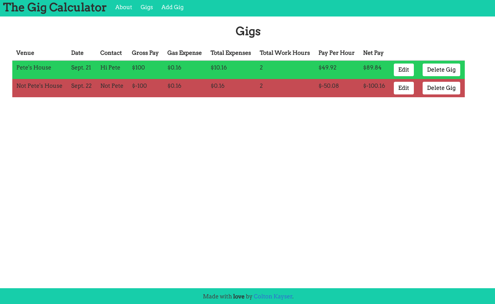

# The Gig Calculator

The Gig Calculator is a MEAN stack application that is styled using the CSS framework, Bulma. It is my final project for my Software Engineering Immersive class at General Assembly. It is a full CRUD app that takes all the variables of a freelance gig, and calculates what you'll actually be making for each gig. Gigs highlighted in green are profitable while gigs highlighted in red are not profitable. Live-link [here](https://gigkeeper.herokuapp.com/).

## Approach Taken

I knew I had to come up with an easy to way to make sense of the data I was asking for, so I made the layout of my index page a chart. I then used AngularJS to manipulate the DOM and change the numbers for each column accordingly. I used a form with the following data points that I needed from the user to make calculations. They are:

* Venue
* Date
* Contact
* Pay
* Gig Length (in Hours)
* Travel Distance (in Miles)
* Travel Time (in Hours)
* Cost of Gas Per Gallon
* Vehicles Mile Per Gallon
* Extraneous Expenses

I wanted to make the user experience as simple as possible so I only put pertinent information into the chart. That data points include:

* Venue
* Date
* Contact
* Gross Pay
* Gas Expense
* Total Expense
* Total Work Hours
* Pay Per Hour
* Net Pay

A visual example of what I'm describing is below:

